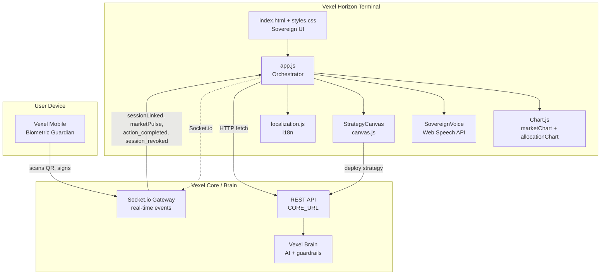

Vexel Horizon is a single-page web terminal built on vanilla HTML, CSS, and JavaScript. It intentionally avoids heavy frameworks so every frame of the Sovereign UI is fast, transparent, and auditable. The browser is the presentation layer — all sensitive writes are routed to Vexel Mobile for biometric approval.

## Design principles

- **Client-side centric** — the entire UI, state, and routing live in the browser. Core supplies data through REST and WebSocket feeds.
- **Dual-state terminal** — the same DOM renders **Guest Mode** (ecosystem data, blurred Pro surfaces) and **Sovereign Mode** (personal vault, unlocked Pro surfaces). The `is-sovereign` class on `<body>` is the toggle.
- **Read-heavy by design** — Horizon never commits capital on its own. Write actions (swaps, votes, strategy deploys) require a Sovereign Guardian signature from Vexel Mobile.
- **Real-time first** — a single Socket.io connection pushes market pulses, action confirmations, and session events so the UI reacts without polling.
- **Modular by file** — each JavaScript file owns one concern: `app.js` orchestrates, `canvas.js` implements the Neural Strategist, `localization.js` handles i18n.

## High-level diagram



## Dual-state UI

### Guest Mode

- Default state on load when `localStorage.vexel_jwt` is absent.
- Surfaces public ecosystem metrics from `/market/public/*` endpoints.
- Pro surfaces (AI Proposals, Neural Allocation, Intelligence Lab, Community Board) are covered with `backdrop-filter: blur` through the `.auth-blur` class.
- A header button prompts the user to open Vexel Mobile and scan the Sovereign Link QR.

### Sovereign Mode

- Activated when the browser receives the `sessionLinked` WebSocket event after a successful mobile scan.
- `app.js` writes the returned JWT to `localStorage` under `vexel_jwt` and the user profile under `vexel_user`.
- `document.body.classList.add('is-sovereign')` runs immediately, clearing every blur filter through CSS.
- `initDashboard()` re-runs with the JWT attached, swapping ecosystem payloads for personal vault data.

## Key modules

| Module | File | Responsibility |
|---|---|---|
| **UI orchestrator** | `app.js` | Routing by hash, WebSocket lifecycle, DOM updates, Chart.js instances, REST calls, session storage, voice toggle. |
| **Neural Strategist** | `canvas.js` | `NeuralNode` and `StrategyCanvas` classes that power the drag-and-drop strategy editor. |
| **Localization** | `localization.js` | Loads `lang/en.json` and `lang/es.json` and hydrates every element with a `data-i18n` attribute. |
| **Sovereign UI** | `styles.css` | Custom design system with glassmorphism, CSS variables, dark theme, and blur/unblur rules keyed off `.is-sovereign`. |
| **Shell** | `index.html` | Semantic skeleton: sidebar, main content sections, modals for Guardian and AI chat. |
| **Voice engine** | `SovereignVoice` (in `app.js`) | Wraps the Web Speech API, maintains the chat history, and updates the microphone indicator. |

## Data flow

### Initialization in Guest Mode

1. The browser loads `index.html` and its scripts.
2. `app.js` generates a unique `sessionId` with `crypto.randomUUID()`.
3. `socket.io-client` opens a connection to `window.location.origin` and emits `registerSession` with the new ID.
4. `initDashboard()` detects the missing JWT, fetches `GET /market/public/ecosystem`, `/market/public/yield/status`, `/market/public/index-history`, and `/market/trending`, and renders the ecosystem dashboard.
5. `localization.js` applies translations to every `data-i18n` element based on the preferred language stored in `localStorage.vexel_lang`.

### Transition to Sovereign Mode

1. The user clicks **Sync with Mobile** or opens a protected section.
2. `showGuardianModal()` renders a QR code encoding the `sessionId`.
3. Vexel Mobile scans the QR and signs the session on Core.
4. Core emits `sessionLinked` with `{ token, user }`.
5. `app.js` stores the token, applies `is-sovereign` to `<body>`, hides the modal, and calls `initDashboard()` again with the JWT header.

### Real-time pulses

- `marketPulse` updates `currentNetWorth`, `yieldVelocity`, the Market ticker, and the system-status indicator.
- A 100 ms `setInterval` interpolates `currentNetWorth` between pulses using `yieldVelocity / 10` for a fluid growth animation.
- `action_completed` populates the execution feedback panel with the result, the AI reasoning, and the Quantum Secured badge when `quantum_secured` is `true`.
- `session_revoked` clears local storage, logs a `SECURITY` entry to the feed, and force-reloads the page into Guest Mode.

### Write actions

Every write action originates on Horizon but completes on Vexel Mobile:

- **Swap** — `POST /market/execute` returns `PendingAuthorization` with a scan result. The user authorizes on mobile and Core fires `action_completed` to the browser.
- **Strategy deploy** — `POST /market/strategy/canvas` sends the Neural Strategist graph. Core runs a simulation, returns the report, and the modal displays projected paths and AI reasoning.
- **Governance vote** — proposals surface via `GET /market/public/proposals`; approval is signed on mobile.
- **Voice command** — the Web Speech API transcribes the command, which is routed through the same Sovereign Guardian flow before any capital moves.

## Client-side state

| Layer | Example |
|---|---|
| Global variables | `sessionId`, `currentNetWorth`, `yieldVelocity`, `isSovereignMode`, `currentLang` |
| `localStorage` | `vexel_jwt` (token), `vexel_user` (profile), `vexel_lang` (`es` or `en`) |
| DOM attributes | `document.body.classList` toggling `is-sovereign`, section `display` toggling, `innerText` updates |
| Class instances | `marketChart` and `allocationChart` (Chart.js), `voiceEngine` (`SovereignVoice`), `vexelCanvas` (`StrategyCanvas`) |

## Running the terminal

Vexel Horizon is a pure static site. Any static file server works — the canonical development flow is:

```bash
cd vexel-horizon
npx serve .
```

In production, Nginx serves the static assets and reverse-proxies `/api` to Vexel Core and `/brain` to Vexel Brain, including WebSocket upgrade headers for Socket.io.

## Related reading

- [Authenticate with Sovereign Link](/sovereign-link) — end-to-end pairing flow
- [WebSocket events](/api-reference/websocket-events) — every real-time event the browser handles
- [Strategy Canvas](/intelligence/strategy-canvas) — node graph semantics deployed from Horizon
- [Vexel Core architecture](/core/architecture) — the backend that powers the terminal
