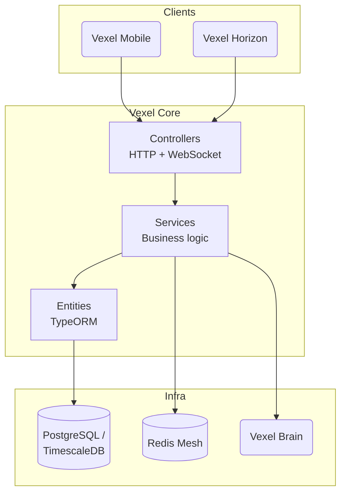

Vexel Core follows a modular, layered architecture with strong domain-driven design boundaries. Each module maps to a business domain and exposes controllers, services, and TypeORM entities. Cross-cutting concerns — security, vault, ledger, mesh — live in a shared `Common` module that every domain can depend on.

## Architectural principles

- **Modularity** — every domain (`Auth`, `Market`, `Governance`, `Events`, `Sentiment`) is a self-contained NestJS module with clear inputs and outputs.
- **Separation of concerns** — controllers handle transport, services hold business logic, entities describe persistence.
- **Domain alignment** — entities like `NarrativePortfolio`, `Proposal`, `Watchlist`, `History`, `TradingLog`, and `Strategy` reflect ecosystem vocabulary rather than technical shapes.
- **Real-time first** — Socket.io gateways are first-class citizens for Sovereign Link handshakes and live market updates.
- **Secure by default** — quantum-hybrid signature checks, HSM-backed verification, vault encryption, and an append-only ledger run on every sensitive path.

## Layered view

## Core data flows

### REST request flow

1. A client issues an HTTP request to Core.
2. Guarded endpoints validate the bearer JWT through `JwtStrategy`; `userId` and `email` attach to `req`.
3. NestJS routes the request to the appropriate controller method.
4. The controller delegates to a service, which reads or writes through TypeORM repositories.
5. For AI-assisted responses, the service issues a signed HTTP RPC to Vexel Brain.
6. The response returns to the client.

### Sovereign Link handshake

The Sovereign Link is the security-critical handshake that binds a Horizon browser session to a Mobile Guardian identity.

<Steps>
  <Step title="Horizon opens a socket">
    Vexel Horizon connects to `EventsGateway`, receives a `socket.id`, and renders a QR code encoding a session identifier.
  </Step>
  <Step title="Mobile posts to /auth/link">
    The user scans the QR with Vexel Mobile, which sends `POST /auth/link` with the session ID and the Mobile JWT.
  </Step>
  <Step title="Core validates and emits sessionLinked">
    `AuthService` validates the token, then calls `EventsGateway.notifySessionLink()`. The gateway emits `sessionLinked` to the Horizon `socket.id` with a new token and the user summary.
  </Step>
  <Step title="Horizon unlocks Sovereign Mode">
    Horizon stores the token and transitions out of Guest Mode.
  </Step>
</Steps>

### Execution approval flow

Sensitive operations — swaps, rebalances, voice commands — never execute on the first request. They require mobile approval.

<Steps>
  <Step title="Initiate operation">
    `POST /market/execute` (or `/market/voice/command`, `/market/autonomous/rebalance`) hits the `ExecutionController`.
  </Step>
  <Step title="AI guardrail scan">
    `ExecutionService` calls Vexel Brain's `/guardian/sanitize` endpoint for a safety score and risk flags.
  </Step>
  <Step title="Park the transaction">
    If safe, Core stores the transaction in a `pendingActions` map under a fresh `txnId`.
  </Step>
  <Step title="Notify Mobile">
    `EventsGateway` emits `pending_action` to the Mobile socket with the `txnId` and details.
  </Step>
  <Step title="Biometric approval">
    The user approves with Face ID or Touch ID. Mobile generates a signature (and optionally a hybrid PQC signature via HSM).
  </Step>
  <Step title="Authorize">
    Mobile calls `POST /market/authorize` with the `txnId` and signature. `ExecutionService.authorizeAction()` verifies the signature through `HsmService`.
  </Step>
  <Step title="Execute and notify Horizon">
    On success, Core runs the underlying service call (for example `TradingService.placeOrder`), writes to the ledger, and emits `action_completed` to Horizon.
  </Step>
</Steps>

### Scheduled jobs

Cron jobs run continuously without user input.

| Service | Schedule | Purpose |
|---|---|---|
| `MarketBroadcasterService.broadcastPulse` | Every 5 seconds | Emits `marketPulse` with ecosystem metrics |
| `MarketService.handlePriceTicker` | Every minute | Updates and emits `priceUpdate` for watched assets |
| `HistorySyncService.syncWatchlistHistory` | Daily | Syncs historical prices into TimescaleDB |
| `AlertService.checkDivergences` | Hourly | Detects divergences and emits `marketAlert` |

## Security surfaces

| Surface | Concern | Implementation |
|---|---|---|
| Transport | Signed payloads between Core and Brain | `SecurityService` with a shared secret |
| Quantum readiness | Hybrid PQC signatures | `HsmService` with `PQ_MASTER_SECRET` seed |
| Secrets | Encrypted vault for sensitive data | `VaultService` with `VAULT_MASTER_KEY` |
| Auditability | Append-only audit trail | `LedgerService` emitting hash-chained JSONL |
| Identity | Passwords and JWTs | bcrypt + `JwtStrategy` |

<Info>
  The ledger integrity endpoint (`GET /market/ledger/integrity`) replays the hash chain and returns a boolean result. Use it in monitoring pipelines to detect tampering.
</Info>

## Related reading

- [Lattice Security](/concepts/lattice-security) — quantum-hybrid cryptography in the Vexel mesh
- [The Mesh](/concepts/the-mesh) — how Core, Brain, Mobile, and Horizon coordinate
- [Sovereign Reasoning](/concepts/sovereign-reasoning) — AI decision model behind guardrails
