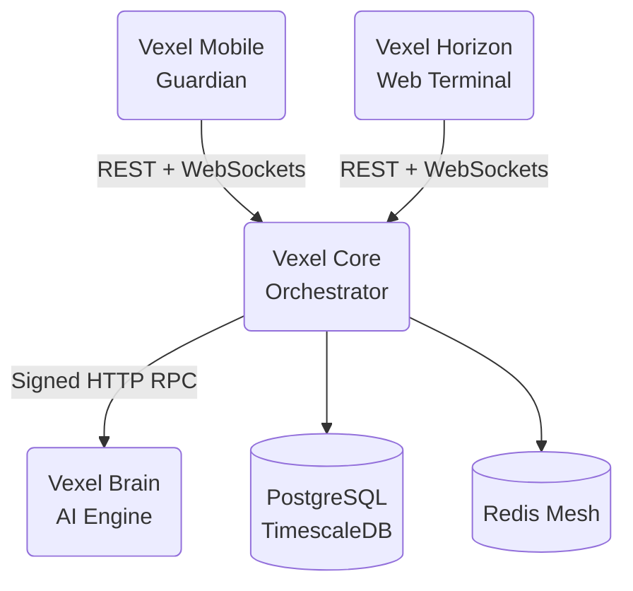

Vexel Core is the central backend service of the Vexel ecosystem. It is a NestJS application that persists data, brokers real-time communication, and acts as the secure gateway between Vexel Mobile (Guardian), Vexel Horizon (Web Terminal), and the Vexel Brain AI engine. Every write action that starts on Horizon, every biometric approval from Mobile, and every AI call to Brain passes through Core.

## What Core does

<CardGroup cols={2}>
  <Card title="Session authority" icon="key">
    Issues JWTs, authenticates users, and binds Sovereign Link sessions between Mobile and Horizon over WebSockets.
  </Card>
  <Card title="Market gateway" icon="chart-line">
    Aggregates quotes, fundamentals, news, and history from Finnhub, CoinGecko, Alpha Vantage, and Twelve Data, and exposes them through a unified REST API.
  </Card>
  <Card title="Execution control" icon="shield-halved">
    Parks sensitive operations, runs AI guardrail scans through Brain, and waits for biometric authorization from Mobile before committing any trade.
  </Card>
  <Card title="Immutable ledger" icon="link">
    Records every critical action to a hash-chained JSONL ledger, providing a tamper-evident audit trail across the ecosystem.
  </Card>
</CardGroup>

## Technology stack

Vexel Core is built on TypeScript and Node.js, using the NestJS framework for modular, scalable architecture.

| Layer | Technology |
|---|---|
| Framework | NestJS 11 (Express adapter) |
| Database | PostgreSQL with TypeORM, TimescaleDB for time-series history |
| Real-time | Socket.io via `@nestjs/websockets` |
| Cache and mesh | Redis with `ioredis` |
| Authentication | JWT via `@nestjs/jwt` and `passport-jwt`, bcrypt for password hashing |
| Scheduling | `@nestjs/schedule` for cron jobs |
| AI bridge | HTTP RPC to Vexel Brain with signed payloads |

## Ecosystem position

Vexel Core sits at the center of the Vexel mesh.

## Module map

The codebase is organized into domain-aligned modules under `src/`.

| Module | Responsibility | Source path |
|---|---|---|
| `Auth` | User registration, login, Sovereign Link session binding, preferences | `src/auth/` |
| `Market` | Market data, portfolios, watchlists, trading, reports, RWA, insurance, taxes, yield | `src/market/` |
| `Governance` | DAO proposals and voting | `src/governance/` |
| `Events` | Socket.io gateways for real-time signaling and high-frequency terminal data | `src/events/` |
| `Sentiment` | Bridge to Vexel Brain for sentiment analysis | `src/sentiment/` |
| `Common` | Security, HSM, vault, ledger, trust, and Redis mesh services | `src/common/` |
| `Database` | TypeORM connection and shared entities | `src/database/` |
| `Config` | Environment-driven configuration | `src/config/` |

## Where to go next

<CardGroup cols={2}>
  <Card title="Architecture" icon="sitemap" href="/core/architecture">
    Layered architecture, data flows, and security boundaries.
  </Card>
  <Card title="Getting started" icon="rocket" href="/core/getting-started">
    Prerequisites, environment variables, and local run commands.
  </Card>
  <Card title="Authentication API" icon="user-lock" href="/core/api/authentication">
    Signup, login, and Sovereign Link endpoints.
  </Card>
  <Card title="Market API" icon="chart-column" href="/core/api/market">
    Quotes, analysis, watchlists, portfolios, trading, and reports.
  </Card>
  <Card title="Real-time events" icon="bolt" href="/core/api/realtime">
    Socket.io gateways, events, and the execution approval flow.
  </Card>
  <Card title="Governance API" icon="scale-balanced" href="/core/api/governance">
    DAO proposals, voting, and the public marketplace.
  </Card>
</CardGroup>
