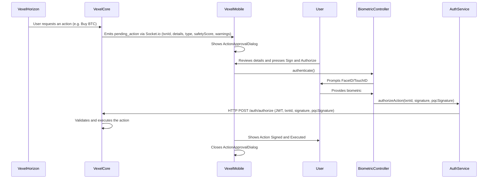

Vexel Mobile is the **Guardian** for all critical write actions. Buying, selling, rebalancing, casting a DAO vote — every one of these originates as a `pending_action` event over the WebSocket and is displayed inside `ActionApprovalDialog`. The user must authenticate with biometrics before the action is signed and forwarded to `Vexel-Core`.

## Flow

## `pending_action` payload

The event sent over Socket.io to `VexelMobile` carries everything the user needs to decide:

| Field | Type | Description |
| :--- | :--- | :--- |
| `txnId` | `string` | Unique identifier for the pending transaction |
| `type` | `string` | `buy`, `sell`, `rebalance`, `vote`, etc. |
| `details` | `object` | Human-readable payload — symbols, amounts, target allocations |
| `safetyScore` | `number` | Risk score produced by Vexel Core's models (0–100) |
| `warnings` | `string[]` | Guardrail messages shown prominently in the dialog |

## Biometric authentication

`BiometricController` wraps `local_auth`. When the user taps **Sign and Authorize**, the controller triggers the OS biometric prompt. On success, the controller produces two signatures:

- A standard device-level signature bound to the `txnId`.
- A **simulated Post-Quantum Cryptography (PQC) signature** based on a Lattice construction. In the current build this is a placeholder with the prefix `pqc_shield_...LATTICE_SALT_SIM`, reserved for a future migration to real PQC primitives.

Both signatures are forwarded to `AuthService.authorizeAction(txnId, signature, pqcSignature)`, which calls `POST /auth/authorize` with the active JWT.

<Warning>
  Never bypass `ActionApprovalDialog`. Any code path that would commit capital without a biometric prompt is a security defect — file it immediately.
</Warning>
