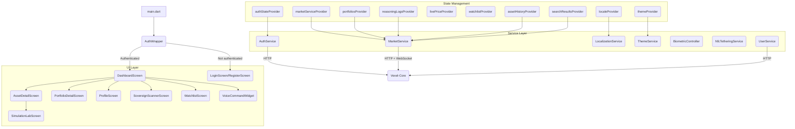

Vexel Mobile adopts a **layered architecture** with strong **MVVM (Model-View-ViewModel)** principles, powered by Riverpod. The structure keeps concerns separated, scales cleanly as features land, and remains fully testable.

## Layers

- **`lib/main.dart`** — application entry point. Initializes Riverpod (`ProviderScope`), theme configuration, `AuthWrapper`, `DashboardScreen` as the main post-auth surface, and the WebSocket bootstrap.
- **`lib/core/config/`** — fundamental configuration such as `AppConfig` (API, auth, market, and WebSocket URLs).
- **`lib/models/`** — data entities used across the app, for example `MarketAsset`.
- **`lib/screens/`** — the **Views**. Every route lives here (`DashboardScreen`, `AssetDetailScreen`, `LoginScreen`, and so on). Screens consume Riverpod providers and stay focused on UI.
- **`lib/services/`** — the **ViewModel / Repository layer**. Encapsulates REST calls, WebSocket streams, secure storage, biometrics, localization, and domain logic. Key services: `AuthService`, `MarketService`, `LocalizationService`, `ThemeService`, `BiometricController`, `NfcTetheringService`, `UserService`. Riverpod providers expose state reactively.
- **`lib/widgets/`** — reusable UI (for example `AssetCard`, `VexelLogo`, `VoiceCommandWidget`). The `ActionApprovalDialog` is the critical biometric-approval surface.
- **`assets/lang/`** — JSON files for i18n (`en.json`, `es.json`).
- **`test/`** — unit and widget tests.

## Component diagram

## State management with Riverpod

Vexel Mobile uses the full Riverpod toolkit. Choose the provider that matches the shape of the data:

| Provider | Purpose | Example |
| :--- | :--- | :--- |
| `Provider` | Stateless services exposed to the widget tree | `marketServiceProvider`, `authServiceProvider` |
| `StateNotifierProvider` | Complex, mutable, observable state | `authStateProvider`, `localeProvider`, `themeProvider`, `livePriceProvider` |
| `FutureProvider` | One-shot asynchronous fetches | `watchlistProvider`, `portfoliosProvider`, `trendingAssetsProvider`, `reasoningLogsProvider`, `assetHistoryProvider`, `searchResultsProvider` |
| `StreamProvider` | Continuous data streams | `priceUpdateProvider` |

<Note>
  The `PriceRegistry` `StateNotifier` aggregates `priceUpdateProvider` events into a single map exposed by `livePriceProvider`. Every widget that needs a current price reads from this one source — duplicate WebSocket subscriptions are avoided.
</Note>

## Internationalization (i18n)

Vexel Mobile ships with English and Spanish translations through a custom localization service.

- **JSON catalogs** live in `assets/lang/en.json` and `assets/lang/es.json`.
- **`LocalizationService`** loads the catalog matching the active `languageCode`.
- **`LocaleNotifier`** reads the user preference from `flutter_secure_storage`, falls back to the system locale, and syncs every change to the backend through `UserService`.
- **`LocaleContext` extension** adds `ref.tr('app_name')` to any `WidgetRef`, keeping translation calls concise.
- **`didChangeLocales`** on `DashboardScreen` (implemented via `WidgetsBindingObserver`) reacts to OS locale changes and updates `localeProvider` when the new locale is supported.

## Dynamic themes

The app ships with two first-class themes: **Slate Black** (dark) and **Premium White** (light).

- **`VexelTheme` enum** enumerates the options.
- **`ThemeService`** is a `StateNotifier` that reads and writes the current theme to `flutter_secure_storage`.
- **`themeProvider`** exposes the active theme to the widget tree.
- **`VexelApp`** listens to `themeProvider` and applies `_buildSlateBlackTheme` or `_buildPremiumWhiteTheme` via `ThemeMode.dark` or `ThemeMode.light`.
- **`VexelColors`** centralizes the palette for both themes.
