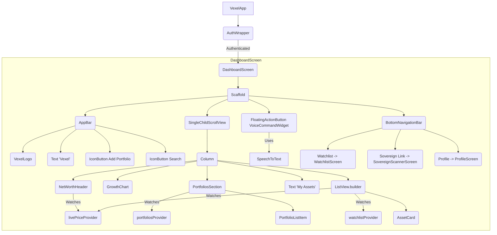

`DashboardScreen` is the first surface a user lands on after authentication. It coordinates live prices, portfolios, and the watchlist while also hosting the `VoiceCommandWidget` and the bottom navigation bar.

## Widget tree

## Key widgets

- **`NetWorthHeader`** — total market value of all holdings. Watches `livePriceProvider` and recomputes on every Mesh pulse.
- **`GrowthChart`** — Syncfusion-powered line chart showing your portfolio performance.
- **`PortfoliosSection`** — lists every portfolio returned by `portfoliosProvider`. Tapping one opens `PortfolioDetailScreen`.
- **`AssetCard`** — compact watchlist row with symbol, name, live price, and 24h change. Tapping one opens `AssetDetailScreen`.
- **`VoiceCommandWidget`** — the floating action button that opens speech recognition. Commands are parsed and routed to the appropriate service action.
- **`ActionApprovalDialog`** — dispatched automatically whenever a `pending_action` event arrives over the WebSocket.

## Creating a dynamic portfolio

1. Tap the `Icons.add_box_outlined` icon in the `AppBar` to open `CreatePortfolioScreen`.
2. Provide a `portfolioName` and add `MarketAsset`s through `AssetPickerSheet` (backed by `searchResultsProvider`).
3. Adjust allocations until the total equals 100%.
4. Press **Save** — `_handleCreate` calls `ref.read(marketServiceProvider).savePortfolio(name, assets)`.
5. `MarketService` sends `POST /market/portfolios` with the JWT and allocation map.
6. On success, `portfoliosProvider` is invalidated; `DashboardScreen` and `PortfolioDetailScreen` refetch and re-render.

## Bottom navigation

| Index | Destination | Screen |
| :--- | :--- | :--- |
| 0 | Portfolio home | `DashboardScreen` content |
| 1 | Watchlist | `WatchlistScreen` |
| 2 | Sovereign Link | `SovereignScannerScreen` |
| 3 | Profile | `ProfileScreen` |
