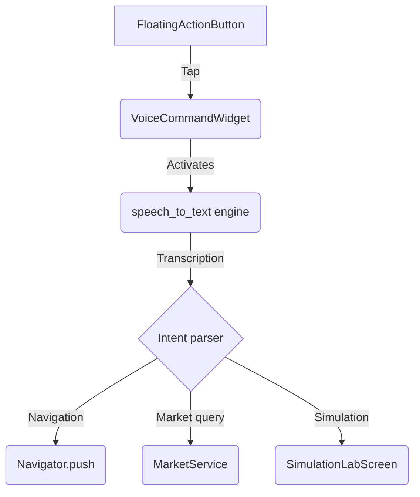

The `VoiceCommandWidget` is the floating action button on [Dashboard](/mobile/dashboard). Tapping it activates `speech_to_text`, captures the user's voice, transcribes the phrase, and dispatches the command to the appropriate provider.

## Supported categories

- **Navigation** — *"Open my watchlist"*, *"Show Bitcoin"*, *"Open profile"*.
- **Market queries** — *"What is the price of AAPL?"*, *"Summarize my portfolio"*.
- **Simulation** — *"Simulate a bull scenario on ETH"* routes to [Simulation Lab](/mobile/screens/simulation-lab) with the spoken hints pre-applied.

## Command flow

<Note>
  Voice commands never trigger a write on their own — they only compose the intent. If a command produces a `buy`, `sell`, or `rebalance`, it is still dispatched through `Vexel-Core`, which then emits `pending_action` so the phone asks for biometric approval.
</Note>
