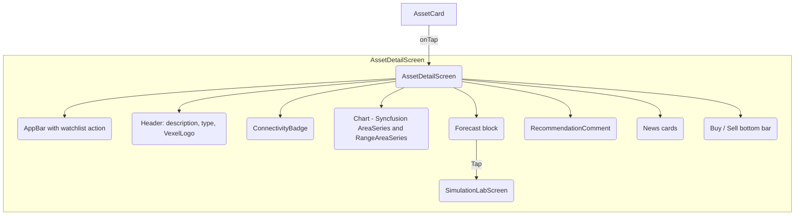

`AssetDetailScreen` is reached from any `AssetCard` in the dashboard, watchlist, portfolio, or search results. It is a `ConsumerStatefulWidget` that fuses real-time price ticks, historical series, AI commentary, and actionable buttons into a single screen.

## Inputs

The screen receives a `MarketAsset` and watches several providers:

- `livePriceProvider` for the current price and the Mesh connectivity source.
- `watchlistProvider` to decide whether to render the **Add** or **Remove** action.
- `localeProvider` to drive re-fetches when the language changes.
- `marketServiceProvider` for imperative calls to `/market/history` and `/market/analysis`.

## Sections

## Data fetching

`_fetchData` runs on `initState` and whenever `localeProvider` changes. It issues two requests in parallel:

- `GET /market/history?symbol={symbol}&type={type}` — historical price series for the chart.
- `GET /market/analysis?symbol={symbol}&lang={lang}` — forecast, recommendation text, and curated news.

The data flows into local state (`_history`, `_forecast`, `_recommendation`, `_news`), and every section renders with its own loading skeleton.

## Buy and sell

Tapping **Buy** or **Sell** opens `_showTradeDialog`, a placeholder that will dispatch a `pending_action` through `Vexel-Core` so the phone receives the familiar biometric approval dialog. Writes never execute directly from this screen — they always round-trip through [Action approval](/mobile/action-approval).

## Forecast card

The forecast card surfaces the AI's projected range for the asset. Tapping it navigates to [Simulation Lab](/mobile/screens/simulation-lab), pre-selecting the current asset so you can run what-if scenarios instantly.

<Note>
  Price values shown in this screen are always sourced from `livePriceProvider`. The chart history is authoritative for the series itself, but the headline price is the latest Mesh pulse.
</Note>
