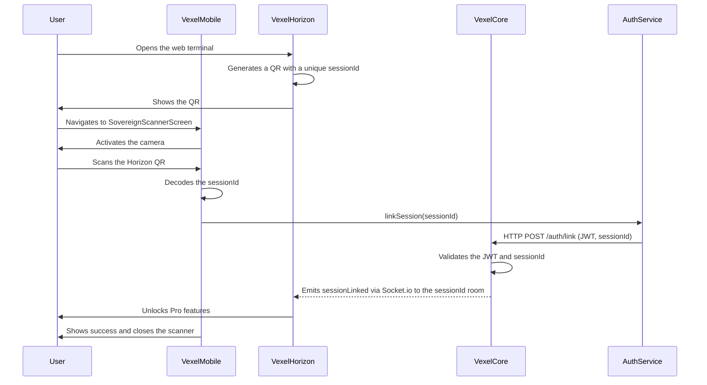

**Sovereign Link** is the biometric QR flow that connects Vexel Mobile to the Vexel Horizon web terminal. After pairing, the browser is elevated from Guest Mode to Sovereign Mode and every write action originating on the web is routed to the phone for biometric approval.

## Flow

## How to pair a device

<Steps>
  <Step title="Open Vexel Horizon">
    In your desktop browser, navigate to Vexel Horizon. Click **Authorize Guardian** or **Authorize Pro Features**. A QR code appears along with a session ID such as `[SESSIONID: 4f2c-9a11]`.
  </Step>
  <Step title="Launch the Sovereign Scanner">
    On Vexel Mobile, open the bottom navigation and tap **Sovereign Link** (or navigate via **Profile > Sovereign Link**). The camera activates inside `SovereignScannerScreen`.
  </Step>
  <Step title="Scan the QR">
    Point the camera at the QR code on the Horizon terminal. The app decodes the `sessionId` and calls `AuthService.linkSession(sessionId)`, which posts `POST /auth/link` to `Vexel-Core`.
  </Step>
  <Step title="Session is linked">
    `Vexel-Core` validates the JWT and session ID, then emits a `sessionLinked` Socket.io event to the session's room. Horizon removes the frosted-glass blur, loads your personal vault data, and the mobile app shows a success confirmation before closing the scanner.
  </Step>
</Steps>

<Note>
  The phone is the only device that owns your biometric credentials. Pairing is symmetric but intent-asymmetric: Horizon can request actions, but only Vexel Mobile can sign them.
</Note>

## Revoking a session

Open **Profile**, find the active web session in the list, and tap **Revoke**. The `_ProfileScreenState` emits a `session_revoked` Socket.io event carrying the specific web `sessionId`. Horizon receives the event, drops back into Guest Mode, and re-applies the blur to Pro surfaces.
